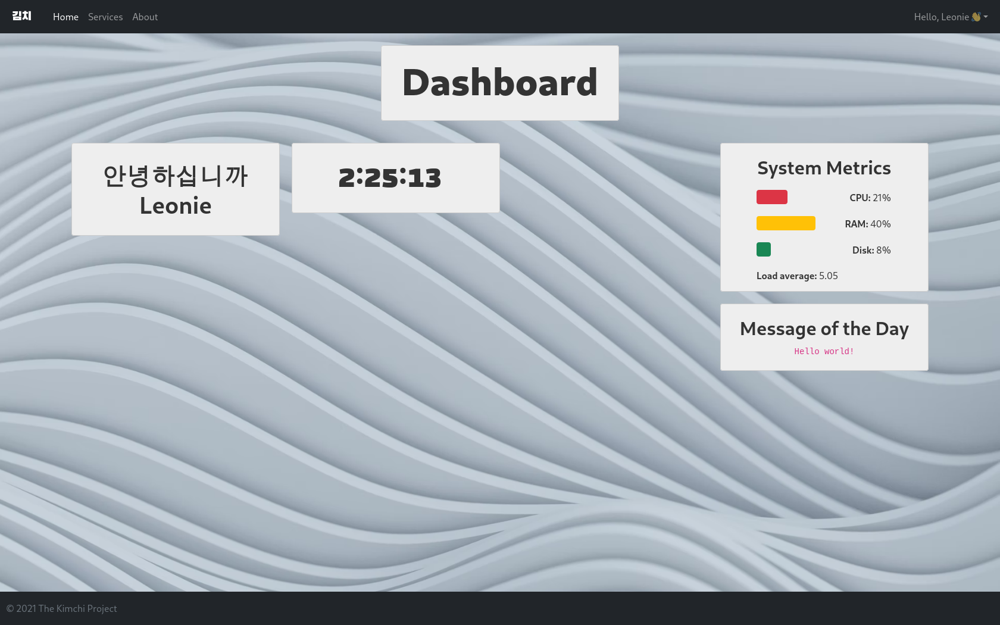

# Kimchi Server Manager

**Kimchi** (김치) is a friendly server management tool written by koyu.space. We made that software in hope it will be useful to you. As always the source code is available so if you want to extend it go ahead.

## Installation

* Install yarn and NodeJS
* Clone the repo
* Create the directories `logs` and `services`
* Run `yarn build`
* Start the backend server with `node backend.js`
* Let nginx serve the dist folder and reverse proxy the backend to `/api/v1`
* Create a Supabase database and import the database scheme for user profiles
* Create a `.env` file like below

```
VITE_SUPABASE_URL=                            # Supabase URL
VITE_SUPABASE_ANON_KEY=                       # Supabase anon key
VITE_BACKEND=http://localhost:2041            # Backend URL
OPS=                                          # User IDs who can access the admin panel, comma seperated (without spaces)
SUDO_PW=                                      # Your sudo password
```

## Screenshot

